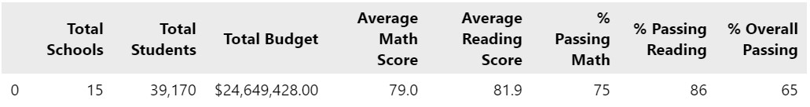

# School District Analysis

## Overview
The local school board received evidence of academic dishonesty in one of district high schools, specifically with 9th graders at Thomas High School. To investigate this report, I'm partnering with my teammate, Maria, to compare district summary data with and without the math and reading test scores from Thomas High School freshman. 

### Purpose
The goal of this analysis is to determine if the data validates this report of academic dishonesty with 9th graders at Thomas High School.

## Results
## To investigate whether there was academic dishonesty, math and reading test scores for 9th graders at Thomas High School (THS) were removed. Data was compared before and after removing these students from our analysis to see how the potentially dishonest scores impacted the results.

- How is the district summary affected?
Looking at the tables below, we can see that only the average math score was impacted by removing THS 9th graders. The average math score decreased from 79 (including THS 9th graders) to 78.9 when THS 9th graders were removed from the analysis.

Data including THS 9th graders

Data excluding THS 9th graders

- How is the school summary affected? - How does replacing the ninth graders’ math and reading scores affect Thomas High School’s performance relative to the other schools?

The school summary percentages of students passing math, reading, and overall decreases dramatically when comparing THS rates including THS 9th graders to rates excluding THS 9th graders. In data including THS 9th graders, THS reports a rate of 93.2% passing math, 97.3% passing reading, and 90.9% passing overall. This is dramatically different to the passing rates when THS 9th graders are excluded: 66.9% passing math, 69.7% passing reading, adn 65.1% passing overall. It's difficult to interpret how to compare to other schools as passing rates range between schools. Comparing by size, type, and per capita spending may reveal more insights.

Data including THS 9th graders

Data excluding THS 9th graders

## How does replacing the ninth-grade scores affect the following:

## Math and reading scores by grade. Replacing the 9th graders math and reading scores with no value does not greatly influence the average scores. They are nearly the same.

Data including THS 9th graders:

Data excluding THS 9th graders:

### Scores by school spending. Similar to math and reading score averages, there is no discernible difference in average math and reading scores by grade level and per capita student spending at high schools. 

Data including THS 9th graders:

Data excluding THS 9th graders:

## Scores by school size. Average scores and passing percentages are not altered for school size either. The averages and percentages are unchanged identical.
Data including THS 9th graders:

Data excluding THS 9th graders:

## Scores by school type. As above, average scores and % passing rates are unchanged with or without THS 9th graders in the analysis.

Data including THS 9th graders:

Data excluding THS 9th graders:

## Summary
By removing the math and reading scores of 9th graders at THS, there were four notable changes in data reported out from THS. This includes the following:
1. The average math score decreased by 0.1 points when THS 9th graders were excluded.
2. The percent of students passing math decreased from 93% to 67% when THS 9th graders were excluded.
3. The percent of students passing reading decreased from 97% to 70% when THS 9th graders were excluded.
4. The overall percentage of students passing math and reading decreased from 91% to 65% when THS 9th graders were excluded.

It does seem concerning that the percentage of students passing is altered so significantly with the exclusion of 9th graders math and reading scores. However, it is not reasonable to make a judgment that there is academic dishonesty as all other metrics for the school with and without 9th graders included are similar to comparable schools. 

